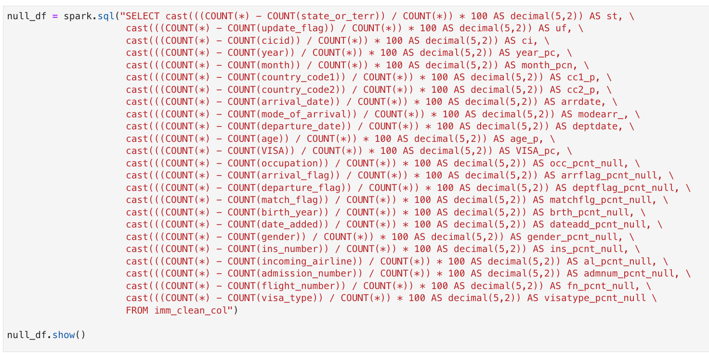
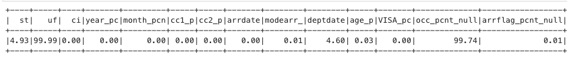
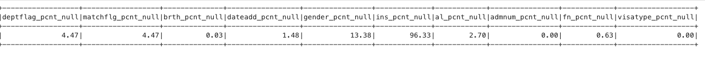
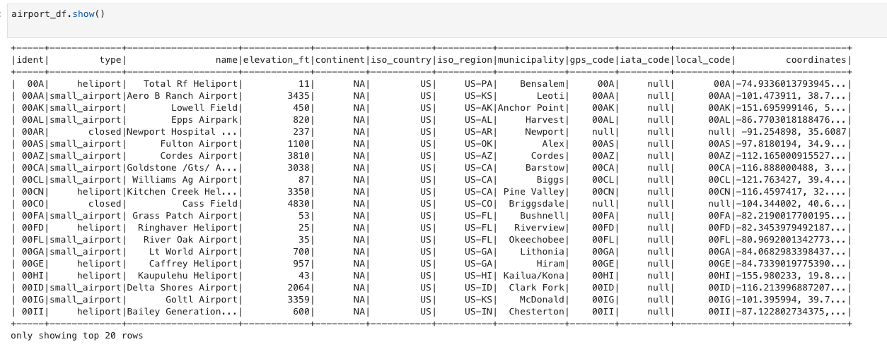
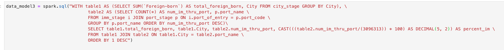
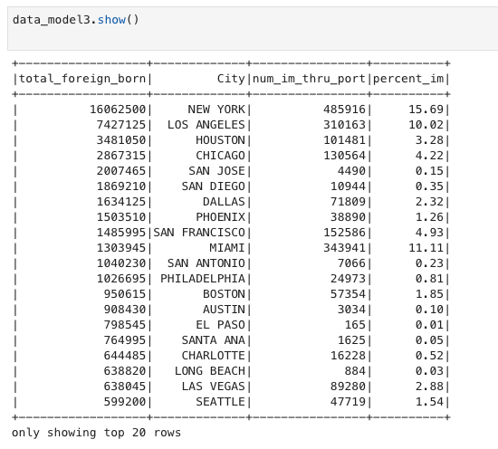

# Udacity Data Engineering Capstone Project

## Project Summary/Writeup

#### Purpose of Final Data Model

The purpose of this project is to create a data model that enriches the I94 immigration data with 
US airport data, US city demographic data, and data descriptions to provide a better basis of 
analysis for the immigration data.

#### Steps taken in project

1. Data exploration.
    
    ##### Immigration Data
    
    All the data in the immigration table was in string format although there are dates, and 
    integers present.  There were also a few columns with substantial missing data that wasn't
    useful.  Below is a dataframe showing the percent null for each column.  Occupation, 
    update_flag, and ins_number columns were mostly null.
    
    
    
    
    
    See null_df in explore_and_clean.ipynb
    
    ##### Label Description File
    
    The label description file has country code data, US port data, and state data.  All 
    of which can be useful in enriching the immigration data. In the US port section of 
    the file there were typos and irregular values that had to be addressed.
    
    ##### Airport Data
    
    Included data from many countries and iso_region format is not compatible with other state 
    format in other data.  Elevation_ft is a string representing an integer value.
    
    
    
    ##### City Demographic Data
    
    This data requires datatype corrections and column name corrections.
    
2. Identify the data model.
    
    <table>
  <tr>
    <th>Table Name</th>
    <th>Columns</th>
    <th>Description</th>
  </tr>
  <tr>
    <td>immigration_table</td>
    <td>cicid int, year int, month int, country_code1 int, country_code2 int, port_of_entry string, arrival_date date, 
        mode_of_arrival int, state_or_terr string, departure_date date, age int, VISA int, arrival_flag string, 
        departure_flag string, match_flag string, birth_year int, date_added date, gender string, incoming_airline string, 
        admission_number double, flight_number string, visa_type string</td>
    <td>This table holds the main data for immigration.  All other tables can be joined to enrich this basis data.</td>
  </tr>
  <tr>
    <td>country_table</td>
    <td>country_code int, country string</td>
    <td>This table contains all the country codes that appear in the immigration table.  This table can be used in a join
        to help make the immigration data more readable for other queries.</td>
  </tr>
  <tr>
    <td>us_port_table</td>
    <td>port_code string, port_name string, state_code string, extra_info string</td>
    <td>This table contains all the data for US ports. Contains port_code and port_name that cooresponds with the 
        immigration table.</td>
  </tr>
  <tr>
    <td>state_table</td>
    <td>state_code string, state_name</td>
    <td>This table contains the state codes and the state names in the proper format.  DC for District of Columbia</td>
  </tr>
  <tr>
    <td>airport_table</td>
    <td>ident string, type string, name string, elevation_ft int, municipality string, gps_code string, iata_code string, 
        local_code string, coordinates string, state_code string</td>
    <td>This table contains airport data with proper state code format that will allow joins with other data.</td>
  </tr>
  <tr>
    <td>city_dem_table</td>
    <td>City string, State string, Foreign-born int, Race string, Count int, Median_Age double, Male_Population int, 
        Female_Population int, Total_Population int, Number_of_Veterans int, Average_Household_Size double</td>
    <td>This table contains city demographics data that can be joined through state code.  Column names are in 
        compatible format.</td>
  </tr>
    </table>
    
    With this data model, the key information from the immigration table can be analyzed and combined 
    with city demographics and airport data to gain insight effectively and efficiently.
    

3. Build ETL pipeline.

    Functions used in etl.py:
    
    * data_qual_check(dataframe, table_name):  Checks to make sure tables are not empty and displays table schema
    * create_spark_session():  This function creates a spark session and returns it to be used in the rest of the etl.py script.
    * process_immigration_data(spark): Takes immigration data and makes it more readable and usable.
        Dates are converted to readable dates and string representations
        of integers are converted to integers.
    * get_label_description_data(): Reads the label description file and returns its content to be used
        for other dataframes.
    * process_country_codes(spark, content): Takes lines from label description file and creates dataframe for country
        codes.
    * process_us_port_data(spark, content): Takes lines from label description file and creates dataframe for US port codes.  In this 
        portion of the description there were typos and abnormalities that needed to be corrected.
    * process_state_data(spark, content): Takes lines from label description file and creates dataframe for state codes.
    * process_airport_data(spark): Reads airport file and filters only US airports.  Creates dataframe and drops redundant columns.
        Converts string representation of integers to integers.
    * process_city_data(spark): Reads US city demographic information and converts string representations of integers to integers. Converts string representations of doubles to doubles.
    
  
4. Run ETL with quality checks and write to parquet.

#### Data Dictionary:

##### Immigration

* cicid - unique identifier for immigration table
* year - year of record
* month - month of record
* country_code1 - country of origin
* country_code2 - country of residence
* port_of_entry - port used to enter US
* arrival_date - date of arrival in US
* mode_of_arrival - mode of arrival, air, land, or sea
* state_or_terr - state or territory in the US
* departure_date - departure date from the US
* age - age of respondant in years
* VISA - visa codes, business, pleasure, or student
* arrival_flag - admitted or paroled into US
* departure_flag - departed, lost I-94 or is deceased
* match_flag - match of arrival and departure record
* birth_year - birth year 4 digits
* date_added - date record was added
* gender - gender of respondant
* incoming_airline - airline used to come to US
* admission_number - admission number
* flight_number - flight number of airline used
* visa_type - class of admission legally admitting the non-immigrant to temporarily stay in US

##### Country

* country_code - country code
* country - country name

##### US Port

* port_code - port code
* port_name - port name
* state_code - state code
* extra_info - auxiliary information after state code

##### State

* state_code - state code
* state_name - state name

##### Airport

* ident - airport ID
* type - type of airport, small airport, heliport...
* elevation_ft - elevation above sea level
* municipality - city/county
* gps_code - gps code
* iata_code - iata identification
* local_code - local code
* coordinates - coordinates longitude, latitude
* state_code - state code

##### City Demographics

* City - city name
* State - state name
* Foreign-born - number of population foreign born
* Race - race
* Count - count
* Median_Age - median age of population
* Male_Population - male population
* Female_Population - female population
* Total_Population - total population
* Number_of_Veterans - number of veterans
* Average_Household_Size - average household size

#### Addressing other Scenarios

##### Data increased by 100x

    If the data size increased by a factor of 100 it would be necessary to us some sort of 
    cluster management tool such as YARN to accomodate additional nodes to process the data.
    
##### The pipelines would be run on a daily basis by 7 am every day

    Airflow could be used to schedule the ETL process and the immigration data should be updated daily.
    
##### The database needed to be accessed by 100+ people

    This data could be loaded to Amazon S3 and later a Redshift cluster so permissions could be given and configured,
    and data can be accessed and analyzed.
    
#### Tools chosen for data model
    
    The tools chosen for this project were pySpark, python, and jupyter notebooks.  pySpark is useful for larger datasets and 
    was thus chosen for data exploration, cleaning, and data modeling.  The ease of use of these tools allows for deep data analysis
    with minimal complexity.  jupyter notebooks were crucial for quick isolated evaluation for data exploration.
    
#### Frequency of Data Updates

    The immigration data is aggregated on a monthly basis so the data for this model should be updated on a monthly basis.
    
#### Using the Data Model

    One use case for the data model could be to see how the immigrants come to the US in comparison with the immigrant population
    of certain cities. When we take the number of Foreign-born (immigrants) from each city we can compare that with the number of 
    immigrants who chose that city as their port of entry.
    
   
    
   
    It seems that the cities with the highest Foreign-born population are also the most popular ports of entries for immigrants
    in the year 2016.  With this query we see that we have successfully used the data model with the immigration table containing
    3,096,313 records and the US cities table containing 2,891 records.
